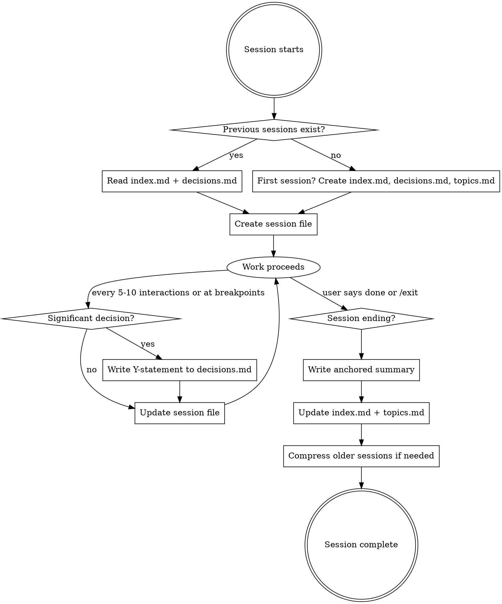

# Elephants Never Forget

Cross-session memory system. Track what happened, what was decided, and what changed — so future sessions start with full context and users can monitor their own patterns.

## Overview

Hooks handle mechanical logging (prompts, tool use, timestamps). **Your job is the intelligent layer**: structured summaries, decision records, friction tracking, and progressive compression of older sessions.

This skill complements (does not replace) Claude's built-in memory system. Use built-in memory for user preferences and quick facts. Use this system for structured session history, decision tracking, and analytical review.

## File Structure

```
.claude-sessions/
  index.md              # One-line per session, newest first
  topics.md             # Tag-to-session mapping (tags = topics)
  decisions.md          # Standing decisions (Y-statements)
  log.md                # Append-only chronological record (hook-written)
  sessions/
    YYYY-MM-DD-topic.md # Per-session detailed file
  raw/
    <session-id>.jsonl  # Mechanical event log (hook-written)
```

## Session Lifecycle



## Opt-Out

If the user says "don't track this session" or similar, skip all session file creation and updates. Hooks will still write to `raw/` and `log.md` (mechanical logging cannot be suppressed from the skill layer), but you should not create or update any files in `sessions/`, `index.md`, `topics.md`, or `decisions.md`.

## When to Update Session Files

Update at **natural breakpoints** — aim for roughly **every 5-10 significant interactions**, not after every single tool call. Concrete triggers:

- After completing a task or meaningful subtask
- After making or reversing a decision
- After encountering and resolving an error
- When a PreCompact warning appears (immediately — context is about to compress)
- When the user ends the session
- **Maximum gap**: If 10+ interactions have passed without an update, update now
- **Minimum gap**: Never update more than once per 3 interactions (avoid noise)

## What Counts as a "Significant Decision"

A decision is significant if it would affect future sessions or is worth remembering:

**Track these**: Technology choices, architecture decisions, approach changes, dependency selections, API design choices, anything the user explicitly frames as a decision.

**Skip these**: Which file to read first, variable naming, import ordering, formatting choices — mechanical choices that don't compound.

**When in doubt**: If you'd mention it in a handoff to another developer, it's significant.

## File Formats

### Session File: `sessions/YYYY-MM-DD-topic-slug.md`

**File naming rules:**
- `YYYY-MM-DD` — today's date
- `topic-slug` — 2-5 word kebab-case summary derived from the session's primary goal. Max 40 chars for the slug.
- Only use `[a-z0-9-]` in the slug. No spaces, underscores, or special characters.
- **Same-day collision**: Append session ID prefix: `2026-04-13-auth-refactor-a1b2.md`

**Frontmatter:**
```yaml
---
session_id: a1b2c3d4
date: 2026-04-13
start_time: "14:30"
tags: [tag1, tag2, tag3]
status: active | completed
summary: "One sentence summary"
---
```

- `session_id`: First 8 characters of the session ID from Claude Code (provided by hooks in the injected context, or available as `$CLAUDE_SESSION_ID`). If unknown, use the first 8 chars of today's date + slug hash.

**Body sections** (write only sections that have content):

```markdown
## Intent
What the user wanted to accomplish this session.

## Interactions
### [HH:MM] User -> <summarized prompt>
**Claude ->** <what you did and why, not full output>

## Decisions
- [HH:MM] Y: In the context of [X], facing [Y], decided [Z] over [alternatives], to achieve [benefit], accepting [tradeoff]. Confidence: high|medium|low

## Reversals
- [HH:MM] REVERSED [previous decision ref]: Changed from [old] to [new] because [reason]

## Files Touched
- `path/to/file.ts` — role: [created|modified|deleted], what: [brief description]

## Errors & Fixes
- [HH:MM] Error: `exact error message`. Fix: [what resolved it]

## Friction Events
- [HH:MM] User redirected approach: was doing [X], switched to [Y]
- [HH:MM] Abandoned approach: [what was tried and why it failed]

## Open Items
- [ ] What remains unfinished
```

### Confidence Levels

| Level | When to use |
|-------|------------|
| **high** | Clear requirements, proven approach, team consensus, or user explicitly chose this |
| **medium** | Reasonable choice but alternatives were viable, or requirements may change |
| **low** | Best guess, limited information, user seemed uncertain, or expedient workaround |

### decisions.md (living document)

Use **Y-statements** — single structured sentences:

```markdown
# Standing Decisions

## [Topic Area]
- [YYYY-MM-DD] Y: In the context of [area], facing [concern], decided [choice] over [rejected], to achieve [benefit], accepting [tradeoff]. Confidence: high|medium|low. Session: [id]
  - ~~[YYYY-MM-DD] Previously: [old decision]~~ SUPERSEDED
```

Rules:
- When a decision is reversed, **create a new entry** and strikethrough the old one. The `SUPERSEDED` label goes **outside** the strikethrough.
- Never delete old decisions — the reversal chain IS the analytical value.
- Group by topic area, not chronologically.
- **At 50+ decisions per topic area**: Split into sub-headings or archive resolved/cold decisions to `decisions-archive.md` with a note in the main file.

### index.md

```markdown
# Session Index

> [Project name] — [total] sessions, [count] active decisions

## Recent
- [YYYY-MM-DD-topic](sessions/YYYY-MM-DD-topic.md): One sentence. Tags: tag1, tag2

## By Topic
See [topics.md](topics.md)

## Standing Decisions
See [decisions.md](decisions.md)
```

Keep each entry to one line, ~30 tokens. At 100+ sessions, archive older entries to `index-archive.md`.

### topics.md

Topics are the same as tags. Each tag from a session's frontmatter gets an entry here.

```markdown
## auth
- [2026-04-13-auth-refactor](sessions/2026-04-13-auth-refactor.md): Refactored auth to JWT

## database
- [2026-04-12-db-setup](sessions/2026-04-12-db-setup.md): Set up PostgreSQL with Prisma
```

### First Session Initialization

When `.claude-sessions/` has no `index.md`, create all three files:
1. `index.md` with the header template (fill in project name from context)
2. `decisions.md` with just `# Standing Decisions`
3. `topics.md` (empty, will be populated at session end)

The hooks automatically create the `sessions/` and `raw/` directories.

## Recalling Past Sessions

When the user asks about past work ("What did we decide about X?", "What happened last week?"):

1. **Check `decisions.md` first** — decisions survive all compression tiers
2. **Scan `index.md`** — find sessions by date, topic, or tags
3. **Check `topics.md`** — find all sessions related to a specific topic
4. **Read the specific session file** — for full detail (if Hot/Warm tier)
5. **Check `raw/<session-id>.jsonl`** — last resort for mechanical log if session file was compressed to Cold tier

## Session Resume

If a previous session was interrupted (you see a session file with `status: active` and no summary):
- Continue updating that session file instead of creating a new one
- Add a note: `## Resumed [date] in session [new-id]`
- Update the session_id in frontmatter to the current one

## Progressive Summarization

Three tiers based on age:

| Tier | Age | What stays | What compresses |
|------|-----|-----------|----------------|
| **Hot** | Current + last 3 sessions | Full detail | Nothing |
| **Warm** | 4-30 days | Anchored summary (below) | Interactions, friction details |
| **Cold** | 30+ days | Frontmatter + summary only. Decisions survive in decisions.md | Everything else removed |

**Anchored summary format** (warm tier — replaces full body):
```markdown
## Intent
Set up authentication for the Express API.

## Changes Made
- Created `src/middleware/session.ts` with express-session config
- Added connect-redis as session store in `docker-compose.yml`

## Decisions Taken
- [14:10] Y: In context of session storage, decided connect-redis over connect-mongo, to achieve fast TTL-based expiration, accepting Redis dependency. Confidence: high

## Next Steps
- [ ] Configure Redis connection for production
```

Note how file paths (`src/middleware/session.ts`) survive verbatim in the warm tier.

### What NEVER gets compressed
- Exact file paths and error codes
- Standing decisions in decisions.md
- Session IDs and dates
- Open items that haven't been resolved

### When to compress
At session start, if sessions exist older than tier thresholds. Compress **one tier at a time**, **oldest first**. If both Cold and Warm compression are needed, do Cold first this session, Warm next session.

## Long Sessions (50+ Interactions)

For very long sessions, keep the Interactions section manageable:
- Summarize groups of related interactions into single entries
- Cap Interactions at ~20 entries; fold older ones into a "## Summary of Earlier Work" section
- Files Touched and Decisions sections have no cap — always keep these complete

## Quick Reference

| Action | What to do |
|--------|-----------|
| Session starts (first ever) | Create `index.md`, `decisions.md`, `topics.md`, and session file |
| Session starts (has history) | Read injected context. Create session file |
| User makes decision | Write Y-statement to session file AND decisions.md |
| Decision reversed | New entry in decisions.md, strikethrough old, log in Reversals |
| Error resolved | Log in Errors & Fixes with exact error message |
| User redirects approach | Log in Friction Events |
| Every 5-10 interactions | Update session file |
| PreCompact warning appears | Immediately update session file |
| Session ends | Write anchored summary, update index.md + topics.md, set status: completed |
| Old sessions exist | Compress per tier thresholds, oldest first, one tier per session start |
| User asks about past work | Check decisions.md -> index.md -> topics.md -> session file -> raw/ |
| User says "don't track" | Skip all session file operations for this session |
| Previous session left active | Resume it instead of creating new file |

## Common Mistakes

- **Logging every single interaction**: Only log significant ones. "Read a file" is noise. "Decided to restructure the auth module" is signal.
- **Compressing file paths**: Never summarize `src/auth/middleware.ts` to "the auth file" — paths must survive compression verbatim.
- **Editing old decisions**: Create new entries, strikethrough old. The reversal chain IS the analytical value.
- **Forgetting to update index.md**: Every session must have an index entry. No orphan session files.
- **Writing to `raw/` or `log.md`**: The hooks handle those. You handle `sessions/`, `index.md`, `topics.md`, `decisions.md`.
- **Creating slug with special characters**: Slugs must be `[a-z0-9-]` only. Sanitize non-ASCII and special chars.
- **Updating after every tool call**: Wait for natural breakpoints. Minimum 3 interactions between updates.
